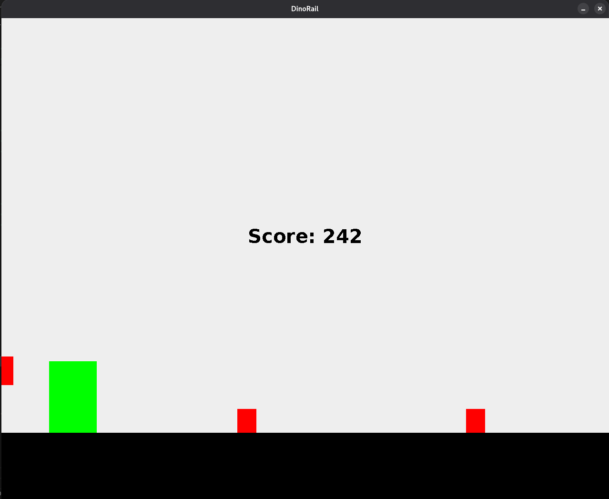

# DinoRail

## Objectif 🥅
DinoRail est un clone du jeu Chrome Dino, conçu pour fonctionner sur des systèmes embarqués comme le Raspberry Pi. Le jeu implémente des obstacles aériens et terrestres à éviter, avec des mécanismes de saut et de crouch pour survivre à la durée maximale possible.

## Structure du projet 📁
- `ClavierBorneArcade.java` : Gestion des entrées du clavier de borne arcade
- `DinoRail.java` : Classe principale du jeu
- `Obstacle.java` : Gestion des obstacles (cactus, oiseaux)
- `assets/` : Ressources graphiques et sonores
  - `img/` : Images des personnages et obstacles
  - `sound/` : Sons de saut et de crouch
- `highscore` : Fichier de sauvegarde des meilleurs scores
- `README.md` : Documentation du projet

## Comment jouer ? 🎢
Le joueur peut interagir via un clavier de borne arcade :
1. **Sauter** : Utiliser la touche haut (↑) ou le bouton "Jump"
2. **S'abaisser** : Utiliser la touche bas (↓) ou le bouton "Crouch"
3. **Recommencer** : Appuyer sur le bouton "Restart" après une collision

## Contributeurs 🤝
- **DUFEUTREL Thibaut** : Développement principal, optimisation des animations, gestion des sons

## Contraintes 🚧
- **Compatibilité Raspberry Pi** : Le jeu a été optimisé pour fonctionner sur des systèmes embarqués avec des ressources limitées
- **Gestion des ressources** : Utilisation optimisée de la mémoire pour les textures et sons
- **Compatibilité graphique** : Implémentation de la bibliothèque MG2D pour les dessins

## Problèmes rencontrés ⚒️
1. **Animations non optimisées** :
   - Délais entre frames trop courts
   - Utilisation de la classe `Animation` entraîne des problèmes de performances
   - Solutions envisagées : réécriture des animations avec un système de frame rate contrôlé

2. **Classe Texture inadéquate** :
   - `Texture` hérite de `java.awt.Rectangle` au lieu de `MG2D.geometrie.Rectangle`
   - Absence de méthodes de dessin liées à la bibliothèque MG2D
   - Solution : Refactorisation pour utiliser le système de dessin de MG2D

3. **Problèmes de performances sonores** :
   - Jouer des sons provoque des freezes lors de l'interaction
   - Solutions envisagées : Utilisation d'un thread dédié pour la gestion audio

## Améliorations prévues 🔺
1. **Textures avancées** :
   - Ajout de textures dynamiques pour les personnages et obstacles
   - Optimisation de la gestion des ressources graphiques

2. **Animations fluides** :
   - Implémentation d'un système de frame rate contrôlé
   - Réécriture des animations pour éviter les problèmes d'optimisation

3. **Synchronisation des scores** :
   - Mise à jour en temps réel des scores dans le menu principal de la borne
   - Sauvegarde des scores dans le fichier `highscore`

## Ressources 📁
- `bouton.txt` : Documentation des boutons de la borne
- `description.txt` : Description détaillée du projet
- `photo.png` : Capture d'écran du jeu
- `photo_small.png` : Version réduite de la capture d'écran

## Notes techniques 📜
- Le jeu utilise la bibliothèque MG2D pour la gestion graphique
- Les sons sont gérés via des threads dédiés pour éviter les freezes
- La gestion des collisions est optimisée pour les performances sur Raspberry Pi